# September 02: what this thing actually has to be

Starting a new project. A 4-layer STM32F722 flight controller for 5" and 7"
cinematic and telemetry quads, carrying a DJI Osmo Pocket 4. Working name Vayu,
which is the Sanskrit word for wind.

I didn't draw anything today. The brief I set myself was "equal to or better than
a SpeedyBee F722 V4 and an iFlight BLITZ F722", and "better" is meaningless until
you write down what you are beating, so I pulled up both boards and made a table.

|          | SpeedyBee F722 V4    | iFlight BLITZ F722 | what I want |
| -------- | -------------------- | ------------------ | ----------- |
| MCU      | STM32F722 216 MHz    | STM32F722 216 MHz  | same        |
| Gyro     | ICM-42688-P / BMI270 | ICM-42688-P        | same class  |
| Baro     | SPL06 / BMP280       | BMP280             | better      |
| Blackbox | 16 MB flash          | 16 MB flash        | same        |
| BEC      | 5 V 2.5 A + 9 V 2 A  | 5 V 2 A + 10 V 2 A | same        |
| UARTs    | 6                    | 6                  | 6           |
| Input    | 3-6S                 | 3-6S               | 3-6S        |
| Mounting | 30.5 x 30.5          | 30.5 x 30.5        | 30.5 x 30.5 |

Two things came out of that immediately. First, 30.5 x 30.5 is a _mounting_
pattern, not a board size, so the board can be bigger than the hole spacing.
Second, both of those boards advertise six UARTs and I assumed that was a
marketing number until I checked, which is tomorrow's problem.

I also decided what I am _not_ building. No SD card - flash is smaller, faster to
write and doesn't rattle loose. No second IMU. No CAN. The mission is cinematic
HD plus telemetry, not racing, and every one of those would cost me board area I
don't have.

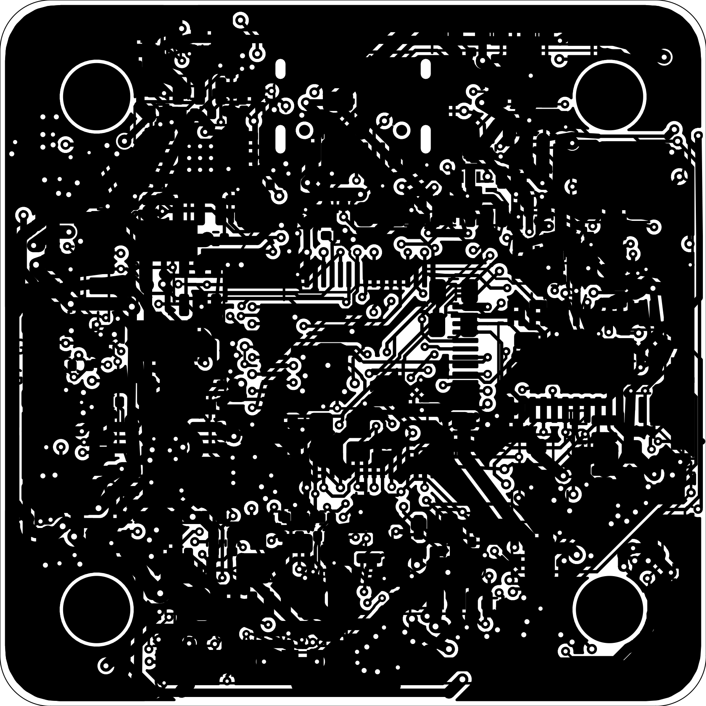

**Total time spent: 2.4 hours**

# September 03: picking the MCU

Today was reading the STM32F722 datasheet and deciding whether it is actually the
right chip, rather than the one I had already decided on.

I looked at the F405 and the H743 as well. The F405 is barely an upgrade on what
is already common and has no headroom for an 8k PID loop. The H743 is lovely and
I cannot afford it, and when I was looking it was out of stock everywhere I could
buy from anyway. F722 it is: 216 MHz, 512 kB flash, and mature in both Betaflight
and INAV so I am not the person debugging the target.

Then I found the thing I had assumed was marketing. **The F722 in the LQFP-64
package only has six usable UARTs.** The datasheet lists eight, but UART7 and
UART8 live on port E and port F, and those ports are simply not bonded out on the
64-pin package. Every F722 board on the market says six for exactly this reason.

That matters because I wanted "two spare UARTs for future proofing" and had been
treating that as extra. It is not extra. It comes out of the six. So the plan
becomes: four UARTs committed (receiver, VTX, GPS, ESC telemetry), two spare, and
the spare ones get brought out to solder pads rather than connectors so they cost
me almost no area.

Decoupling rule I set myself while I was in there, and kept for the whole build:
one capacitor per supply pin, each drawn on its own line to the pin it decouples.
It makes the schematic longer and the layout obvious.

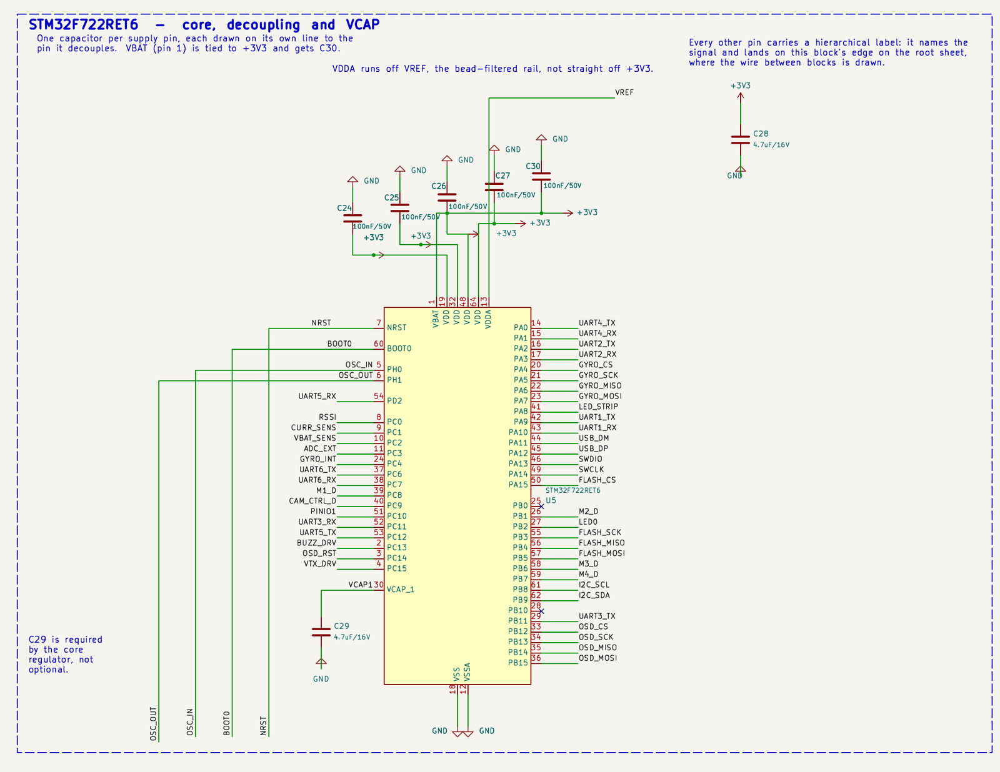

**Total time spent: 2.8 hours**

# September 04: the gyro, and one footprint for three parts

Gyro day. This is the part that decides how the quad flies, and it is also the
part I am least able to buy reliably, which turns out to be the whole story.

The shortlist was ICM-42688-P, BMI270 and ICM-42605. The 42688 is the best of the
three - lower noise, 32 kHz output, and it is what the BLITZ uses. The BMI270 is
what you fall back to when the 42688 is unobtainable, which in India it very
often is. The 42605 is the cheap one.

Rather than pick one and hope, I checked the three datasheets against each other
pin by pin and found they share a 14-pin 3 x 2.5 mm LGA footprint with compatible
pinouts for everything I need: SPI, interrupt, both supplies. **So I drew one
footprint that takes any of the three** and wrote the differences into the
schematic as text - mainly that pin 9 is INT2/FSYNC/CLKIN on the TDK parts and
has to be tied to GND when FSYNC is unused, which is straight out of TDK's
datasheet.

That felt like the cleverest thing I had done all week. It is worth saying now
that a week later I worked out it was clever about a problem I had invented for
myself, and the entry for the 9th explains why.

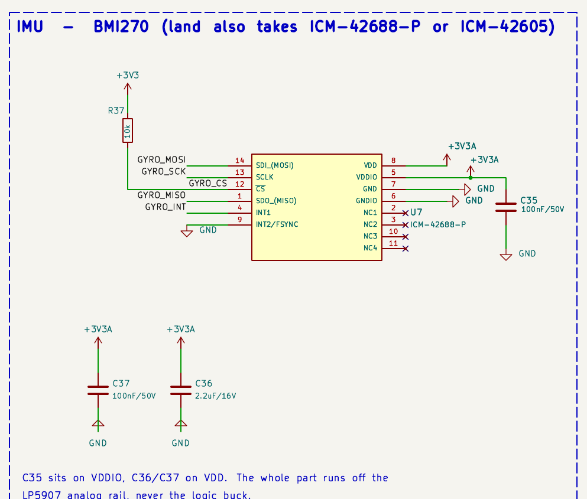

**Total time spent: 2.6 hours**

# September 05: baro, OSD and blackbox

Filling in the rest of the sensor and peripheral picks.

**Barometer.** Both reference boards use a BMP280 or an SPL06. I want better,
because altitude hold and GPS rescue accuracy live and die on baro noise. The
BMP390 is the obvious upgrade. Noted it and moved on, and this comes back to bite
me when I actually try to buy one.

**OSD.** AT7456E, which is a clone of the MAX7456. The alternative is MSP
DisplayPort drawn by the goggles, which costs zero hardware, but that only works
on digital systems and I want the board to be useful on analog too. So the analog
OSD goes on, with its own 27 MHz pixel clock and the video path around it.

**Blackbox.** W25Q128JVSIQ, 16 MB, SOIC-8, on its own SPI bus. 16 MB is about
twenty minutes of useful logging at the rates I care about. I looked at the
smaller WSON packages to save area and decided the SOIC-8 leads are worth the
space, because I might have to hand-solder one.

Three SPI buses, then: gyro on its own, OSD on its own, flash on its own. The
gyro absolutely cannot share a bus with anything - the timing of that data _is_
the flight performance.

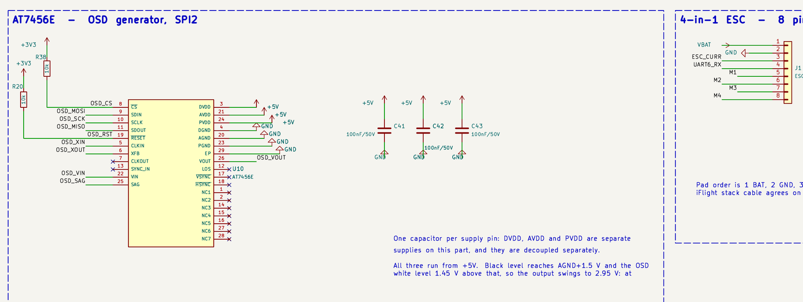

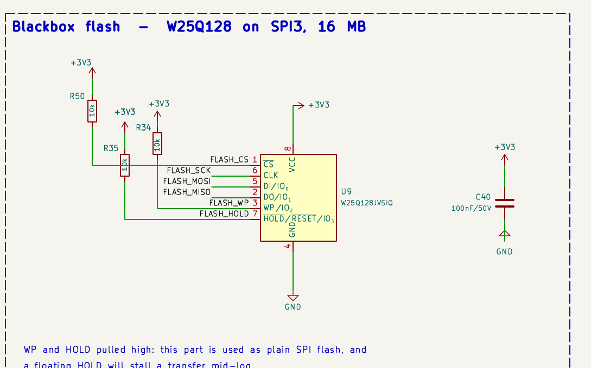

**Total time spent: 2.1 hours**

# September 06: two suppliers and a lot of dead ends

The hard constraint I set myself: every part from lioncircuits.com or robu.in.
Nothing else. No LCSC, no AliExpress. The idea was that if I am in India, buying
in India avoids the entire import mess.

I have never had sourcing drive a design this hard before. I wrote a small
scraper against the LionCircuits part pages - they ship a `__NEXT_DATA__` JSON
blob with stock, lead time and the full price-break table - and started checking
candidates _before_ drawing them.

What I found, in the order it hurt:

**The OSD isn't in either catalogue.** LionCircuits lists MAX7456EUI+ with no
offer. So the analog OSD has to go on the board as a do-not-populate option: the
footprint, the crystal, the video path and the decoupling all there, shipping
unpopulated, with a part number in the docs for whoever wants it. That is a
genuinely bad outcome for a feature I wanted.

**The 3.3 V regulator I picked is out of stock.** TLV1117LV33, gone. Went looking
for SOT-223 alternatives and landed on AZ1117CH-3.3TRG1 at 8.48 rupees with 10k
in stock. SOT-223 matters: the same part in SOT-23-5 would dissipate
(5 - 3.3) x 0.4 = 0.68 W in a package with about 190 C/W, which is a 129 degree
rise. SOT-223 is about 60 C/W. Package choice _is_ the thermal design.

**The USB-C connector** KiCad has a footprint for isn't there either. GCT
USB4105-GF-A is, with 138,999 in stock, and KiCad ships the official footprint
drawn from GCT's own drawing. It has through-hole shield legs, which I care about
more than the price - the number one way a flight controller dies is somebody
yanking the USB cable sideways and tearing an SMD connector off the board.

About 120 part numbers queried today. Not one line of schematic drawn. Worth it.

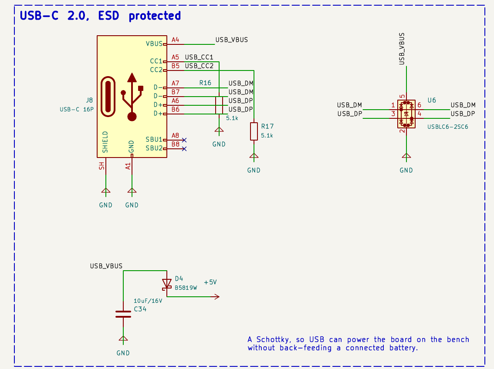

**Total time spent: 3.4 hours**

# September 07: power maths before I draw anything

Two buck converters. Both TPS54540 at this point - 42 V in, 5 A, in stock at 374
rupees, which matters because at 6S I am feeding them 25.2 V and most cheap bucks
top out below that.

Did the arithmetic before drawing a single symbol, because a buck you size by
guessing is a buck that runs hot and you find out about it in the air.

**5 V rail.** Loads: MCU and sensors through the 3.3 V regulator, receiver
100 mA, GPS 100 mA, camera 150 mA, OSD 40 mA, LED strip up to 500 mA, buzzer
30 mA. Call it 1.4 A worst case, and that is genuinely worst case, because nobody
runs a full LED strip and a GPS and a camera flat out at the same time.

**10 V rail for the VTX.** An HD air unit peaks around 1.2 A, so about 11 W. I
sized the rail at 2 A for headroom.

Then the inductors. Ripple current is Vout x (1 - Vout/Vin) / (L x fsw), and at
6S in with a 6.8 uH inductor the 5 V rail comes out around 1 A peak-to-peak,
which is fine on a 3.5 A part. I picked inductors on **saturation current** rather
than inductance alone, which I think is the mistake most people make - a 6.8 uH
part that saturates at 2 A is a 2 uH part the moment you actually need it.

Also wrote the feedback divider values down properly, so I am not doing that
arithmetic at 1 a.m. with the schematic open.

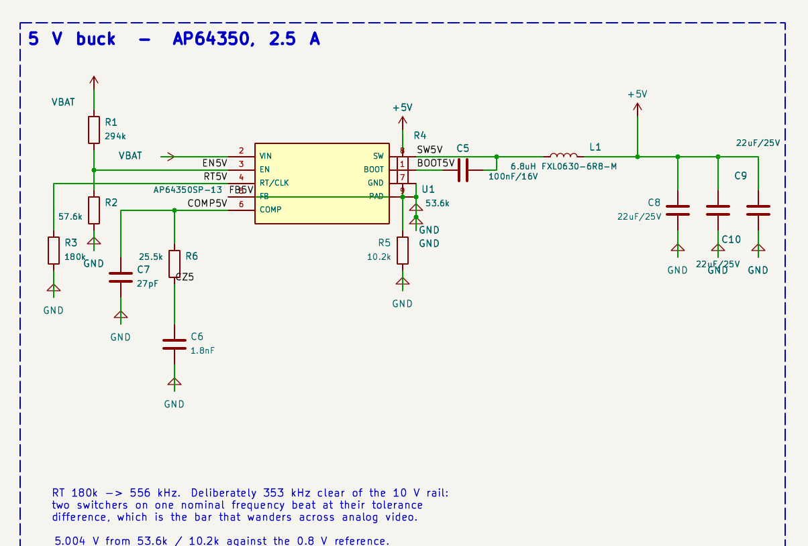

**Total time spent: 3.1 hours**

# September 08: the 3.3 V rail is wasting half a watt

Went back to the 3.3 V rail I settled yesterday and I don't like it.

The AZ1117 is a linear regulator. It takes 5 V in and gives 3.3 V out, and the
difference does not disappear, it becomes heat. (5 - 3.3) x 0.3 A = **0.51 W**.
On a board that lives sealed inside a carbon frame with no airflow, half a watt
of nothing-useful is a real problem, and it is sitting right next to the gyro,
which is the one part on the board that hates temperature gradients.

The alternative is a small buck. About 90% efficient, so the same rail wastes
about 0.04 W instead of 0.51 W. The obvious objection is that a switching
regulator next to sensitive analog parts is exactly what you are told not to do -
but I am going to have a separate analog rail anyway, fed by a proper low-noise
LDO, and only the gyro and the baro hang off that.

So: buck for the main 3.3 V digital rail, small LDO for the analog rail. The LDO
is deliberately inefficient and that is correct - it buys about 30 dB of supply
rejection on the rail feeding the gyro, for about 25 mW.

Couldn't buy the buck I wanted from either Indian vendor. Noted it as a problem
and left the LDO in for now. That problem is about to get much bigger.

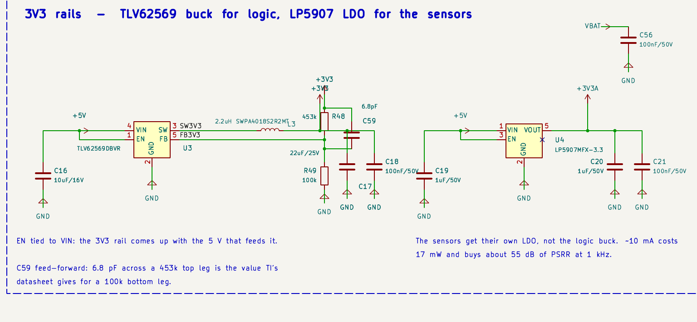

**Total time spent: 2.7 hours**

# September 09: customs, Australia, and giving up on my own clever idea

Spent today adding up what my own sourcing constraint actually costs, and then
threw the constraint out.

The universal gyro footprint I was so pleased with on the 4th exists because the
ICM-42688-P is about 2000 rupees at Robu and the BMI270 is 387 at LionCircuits.
On LCSC the ICM-42688-P is about 180. The footprint trick saves 1612 rupees a
board against a price that only exists because of where I am buying. The clever
part of my design was clever about a problem I invented.

Same story all the way down the BOM. The OSD is not a DNP footprint on LCSC, it
is C82351, in stock, and I can just fit it. The 3.3 V buck I couldn't get is
available. Six parts change and every single one improves.

So: JLCPCB, assembled. Which means dealing with the import side.

**And the import side isn't really about the money.** JLCPCB into India means
duty plus IGST on top of the board price, and then customs clearance, which
nobody can give you a date for. Two to three weeks is normal. Sometimes it just
sits.

I have family in Australia, and I looked seriously at shipping the batch there
and carrying it back next time somebody travels - postage to AU is cheaper and
faster than to IN, and it arrives as a used device in somebody's bag rather than
as an import. Then I worked out what that actually means for a project like this.
I would be waiting on somebody else's flight to get revision one, and if revision
one has a mistake in it - it will - then revision two waits for the flight after
that. A two-week customs queue I can plan around. A three-month travel dependency
I cannot.

So it ships to India, duty paid, and I build the delay into the plan instead of
routing around it. One consequence, and it shapes everything after this:
**I get one shot at the first batch.** Ordering twice costs me a month of
calendar, not 2000 rupees. That is why the back half of this journal is me
reviewing the board instead of drawing it.

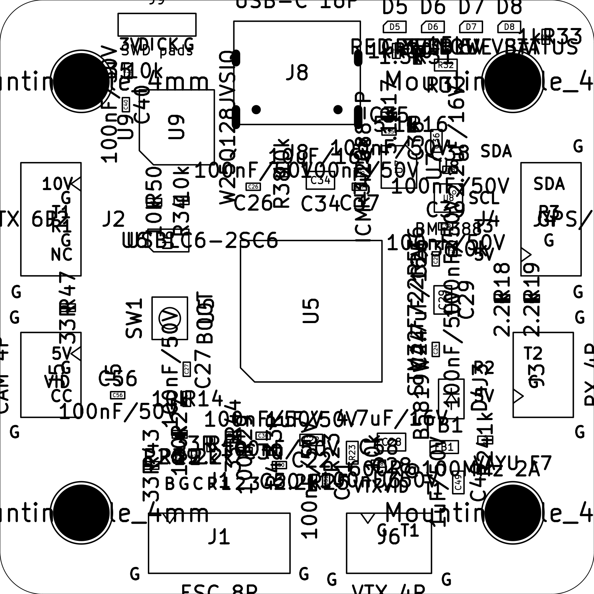

**Total time spent: 3.2 hours**

# September 10: re-sourcing everything

Six parts changed today and every one of them rippled.

**The bucks: TPS54540 to AP64350.** The TPS54540 is asynchronous - it needs an
external catch diode, and that diode drops about 0.5 V for the whole off-time.
The AP64350 is synchronous, so a low-side FET replaces the diode. At 5 V / 1 A
from 4S that is roughly 89-92% efficient instead of low 80s, and it deletes two
diodes and their footprints. 3.8-40 V in, 3.5 A out, SO-8EP with a thermal pad.

**The 3.3 V rail: AZ1117 to TLV62569.** Finally. The half-watt problem from the
8th is gone - 2 A buck in SOT-23-5, about 90% efficient, and the whole thing
including its inductor is physically smaller than the old SOT-223 was on its own.

One thing I nearly got wrong and want to write down: the TLV62569's feedback
reference is **0.6 V**, not 0.8 V like the AP64350. Same board, two regulators,
two different references. Get that backwards and the divider that should give
3.3 V gives 4.4 V and the MCU is dead. I put both numbers on the schematic as
text so future me can't misremember them.

**The gyro: BMI270 to ICM-42688-P.** At 180 rupees I can fit the better part. The
universal footprint stays, because it costs nothing and is now insurance rather
than a cost lever.

**The baro: BMP390 to BMP388.** I wanted the 390. No stock at the quantity I
need. Same family, same footprint, same address scheme, marginally worse noise.
Second time this project that "better part" has lost to "part that exists".

**The OSD goes from DNP to fitted.** C82351.

**The VTX rail: 9 V to 10 V.** Both numbers are arbitrary - HD VTXs take 7-26 V.
10 V gives more headroom over the VTX's own regulator dropout without pushing the
duty cycle anywhere awkward on 4S.

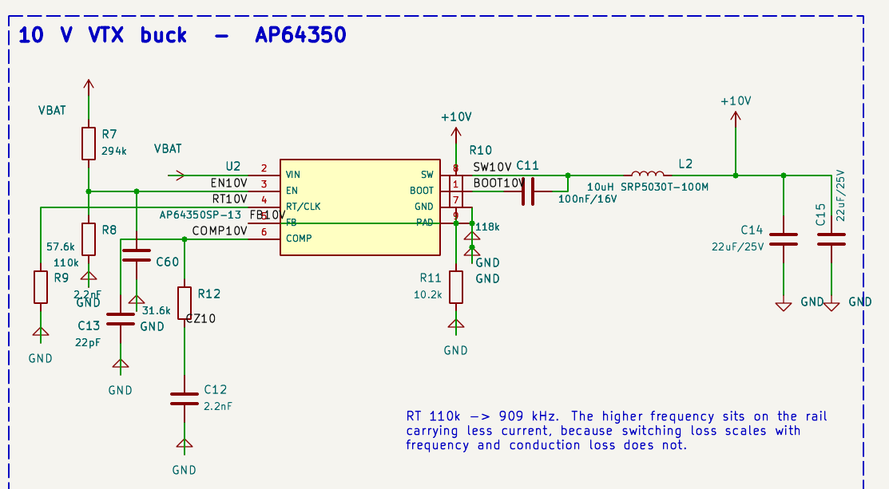

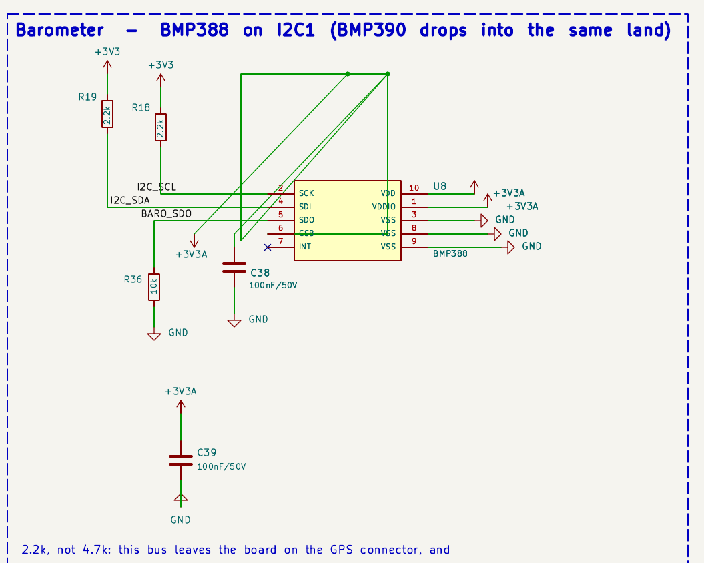

**Total time spent: 3.1 hours**

# September 11: datasheets, and what each chip drags along with it

Today was pure reading. Every chip on the BOM, and the question for each one is
the same: what does this part need around it that is not obvious from the block
diagram, and how close does it have to sit?

I used AI to speed this up - not to make the decisions, but to pull the relevant
tables out of 200-page datasheets so I could check them myself instead of
scrolling for an hour. It turns a day of hunting into an afternoon of verifying,
and the verifying is the part that actually matters.

The list I ended up with:

- **STM32F722 VCAP_1.** The datasheet gives two values depending on package:
  2.2 uF for packages with two VCAP pins, **4.7 uF for LQFP-64**, which has one.
  Table 19. Undersized here does not fail cleanly - you get a chip that boots most
  of the time and browns out under load.
- **VREF.** Ferrite from +3V3, then 1 uF plus 100 nF, as close to the pin as I can
  physically get them.
- **AP64350 bootstrap.** 100 nF between BST and SW. BST and SW are the two ends of
  one package edge, so the capacitor ties to SW - the node with the fast edge -
  and BST takes the longer side of the loop.
- **AP64350 compensation.** It is externally compensated, Type II: a series R and
  C to ground off COMP plus a small high-frequency cap. Two more parts per rail
  that I had not budgeted board area for.
- **AT7456E crystal: no external load capacitors.** The datasheet says it
  outright - all the capacitors the Pierce oscillator needs are on-chip. I would
  have fitted two out of habit, and a 27 MHz oscillator that is over-loaded may
  simply not start.
- **8 MHz HSE.** Load caps are (2 x CL) - stray, so a 12 pF crystal with about
  4.5 pF of stray wants 15 pF a side. Not 12, not 22.
- **I2C pull-ups go on the analog rail, not the digital one.** Bosch is explicit:
  driving a pin high while VDDIO is off can permanently damage the part. If the
  pull-ups sat on +3V3 and the analog LDO came up later, the baro would get
  exactly that on every single power-on.

The distance rules matter as much as the values. Decoupling within a couple of
millimetres, compensation within three or four, bootstrap under two. Those become
placement constraints later, not suggestions.

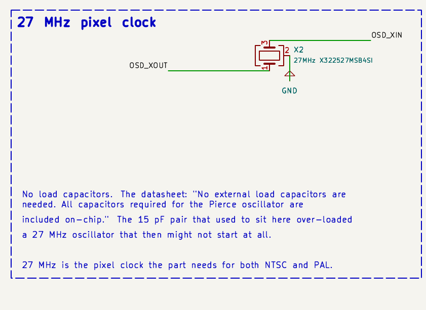

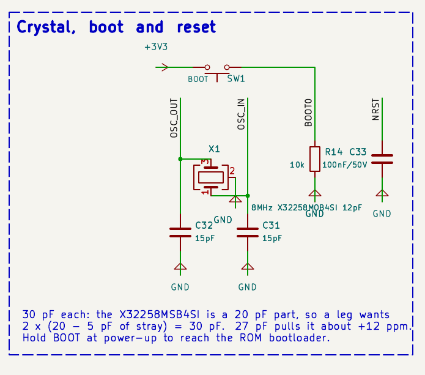

**Total time spent: 3.2 hours**

# September 12: the pin map, first pass

Mapping GPIO. This is where an F7 flight controller is actually won or lost, and
I wanted to do it on paper before KiCad had an opinion about it.

The method: group by physical proximity on the package, so that when I place the
MCU the traces fan out instead of crossing over each other. A pin map that is
electrically valid and geometrically stupid costs you a whole layer.

What I had at the end of the day:

- Motors on TIM3 and TIM4, four of them clustered on port B
- Two more motor outputs on TIM8, port C
- SPI1 for the gyro on PA4-PA7, which is the tightest cluster on the package
- SPI2 for the OSD on PB12-PB15
- SPI3 for the flash on PA15 / PB3 / PB4 / PB5
- UART1 on PA9 / PA10 for the VTX
- UART2 on PA2 / PA3 for the receiver
- UART3 on PB10 / PC11 for GPS
- I2C1 on PB8 / PB9, which also goes out to the GPS connector for an external
  compass
- USB on PA11 / PA12, SWD on PA13 / PA14
- ADCs on PC0-PC3

Six motor outputs felt right at the time - a quad with two spare for a hex or a
gimbal. I come back to that.

Everything cross-checked against DS11853 Table 12 for the alternate functions and
RM0431 Tables 26/27 for the DMA streams, because a timer channel with no DMA
stream free is a motor output that cannot do DShot.

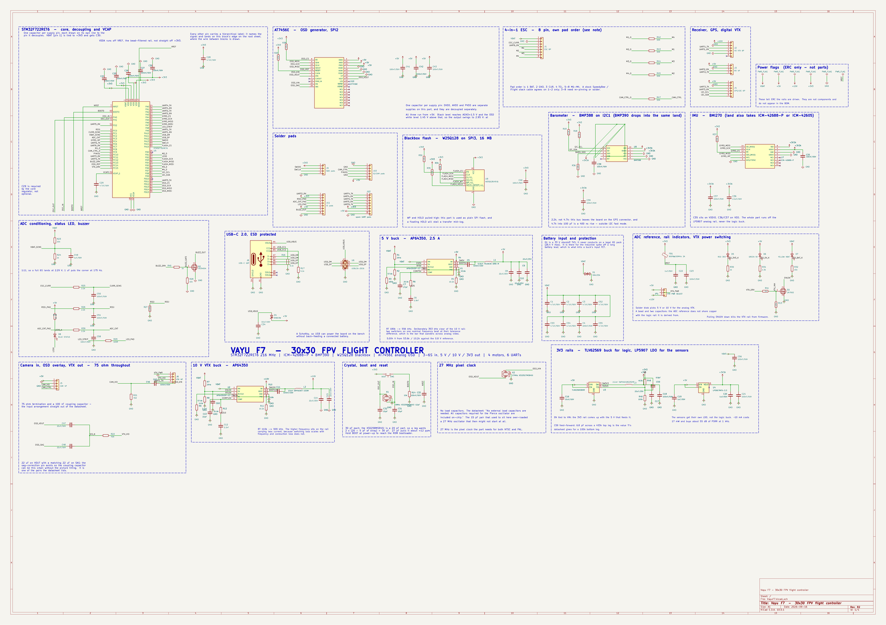

**Total time spent: 2.9 hours**

# September 13: two pins that would have bricked the board

Went back over yesterday's pin map line by line instead of trusting it, and found
two things that would otherwise have shipped.

**The critical one: two of my motor outputs were impossible.** I had motors 7 and
8 on PC10 and PC11. On LQFP-64 those pins have _no timer alternate function at
all_. Not a different timer - none. They can be UART, SPI, SDIO or GPIO and that
is it.

The reflex is "so bitbang them". Betaflight can. **INAV cannot** - I went and read
the INAV source to be sure, and there is no DShot bitbang implementation in it.
So on INAV those two outputs would simply not exist. Fixed by dropping to six
timer-backed outputs and turning PC10/PC11 into PINIO pads, which is what they
are actually good for: switching a camera or a VTX on and off.

**The second one: VCAP_1 again.** I had written 2.2 uF into my notes despite
reading Table 19 two days earlier. It is 4.7 uF on LQFP-64. Changed it, and I am
now suspicious of every value I transcribed rather than copied.

**And the DMA problem.** Six DShot outputs across TIM3, TIM4 and TIM8 all want
DMA streams, and on the F7 TIM3 and TIM4 both live on DMA1 with overlapping
choices. The way out is burst mode (`USE_DSHOT_DMAR`), where one stream serves
all four channels of a timer through the burst register. That is a firmware flag,
not a hardware fix, so I wrote it straight onto the schematic sheet where whoever
ports the target cannot miss it.

The two spare UARTs come out on solder pads on the underside rather than
connectors. Costs me almost nothing in area and means the board doesn't dictate
what you plug into it.

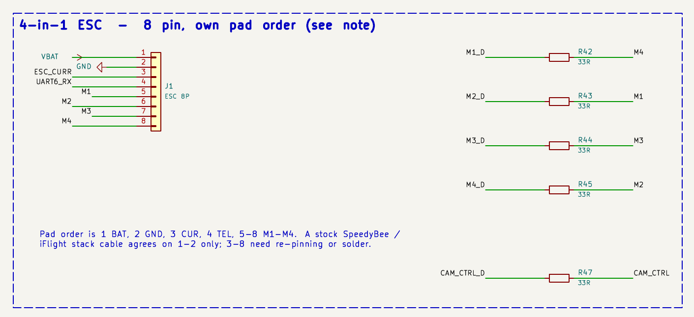

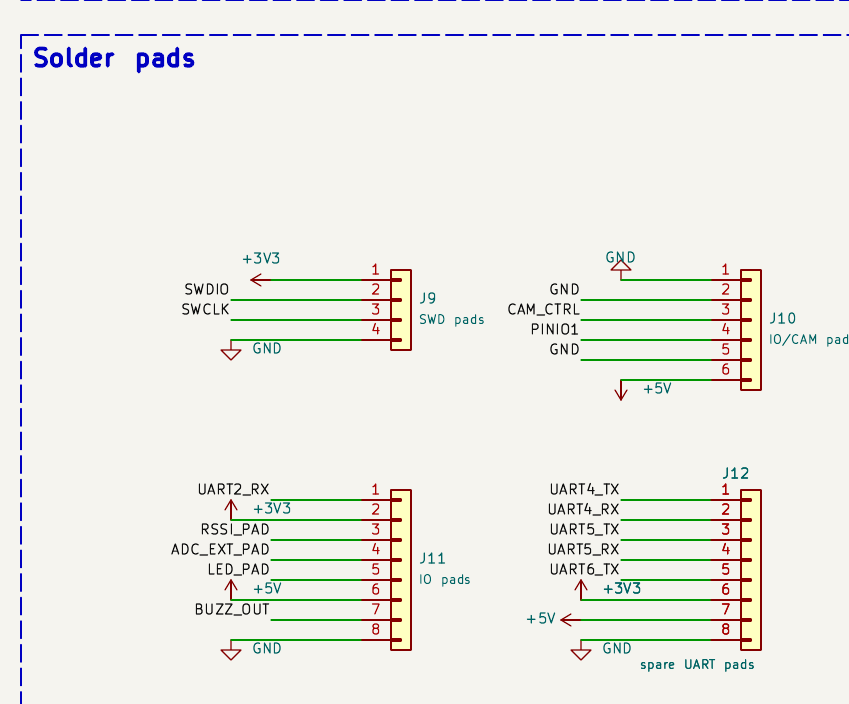

**Total time spent: 3.1 hours**

# September 14: the schematic finally starts looking like a board

Started actually drawing in KiCad. Two things went wrong and both taught me
something.

I kept the power section together, put the MCU in the middle, and worked outward
to the sensors and connectors. That sounds obvious until the sheet is full of
crossing wires and every small change makes the next one harder. The layout is
already influencing the schematic: the gyro gets its own SPI bus, the flash and
OSD stay separate, and the connector pin order is chosen with the eventual
routing in mind.

The first pass also exposed a much less interesting but more dangerous problem.
The regulator's RT/CLK pin and exposed ground pad were sitting in the symbol but
were not actually connected to anything. A regulator with no timing resistor does
not switch, and a regulator with a floating thermal pad has no proper return.
ERC did not make the mistake obvious because the symbol looked complete while I
was skimming it.

I fixed those connections by hand and started checking every pin against the
datasheet, not just trusting a clean-looking page. "The schematic looks finished"
and "the circuit is connected" are two different claims.

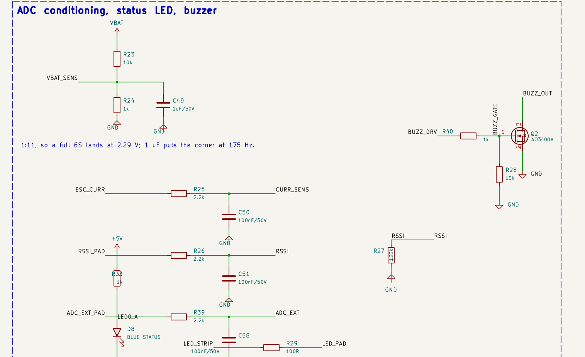

**Total time spent: 3.3 hours**

# September 15: reading my own schematic like I want it to fail

Spent today reviewing yesterday's schematic as if somebody else had drawn it and
I were being paid to find the mistake. Found fourteen things, two of which were
serious.

The two that mattered:

- A **feedback divider tied to the regulator's output node instead of the FB
  pin.** On a schematic those look identical if you are skimming. In silicon it is
  a regulator running open loop at maximum duty cycle, which on the 10 V rail
  means the VTX sees battery voltage.
- **Flash WP and HOLD, and the baro SDO, tied hard to rails.** ERC flags that as a
  bidirectional pin driven by a power output, and I had been about to suppress the
  warning. The right fix is 10k straps instead of hard ties, which is also just
  better engineering - now I can change the flash write protection or the baro's
  I2C address with a resistor instead of a knife.

The other twelve were smaller: missing decoupling on two supply pins, a
compensation cap on the wrong side of a resistor, an LED with no ballast, a
reverse-polarity FET drawn with its body diode the wrong way round.

Ended the day at 0 ERC errors and 0 warnings, which I am now aware means less
than I thought it did yesterday.

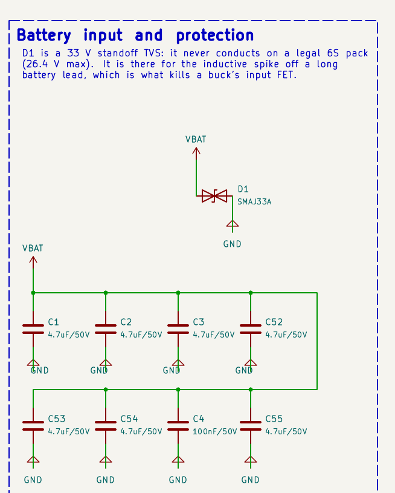

**Total time spent: 2.1 hours**

# September 16: 38 x 38 doesn't fit, and the first placement embarrassed me

Long day. Took the schematic to a board and found out my board was too small.

I had planned 36 x 36 mm and it does not fit. I proved it rather than eyeballing
it - wrote a check that sums courtyard area per side and compares it against
usable board area once you subtract the four mounting-hole keepouts and the
connector ring. 36 x 36 needs about 118% of the space it has. 38 x 38 gets it
under 100% and that is what I laid out.

(It ends up at 42 x 42 eventually. The connector ring is what kills you - six
JST-SH housings round the edge, each needing its own approach clearance, and none
of that area is usable for parts.)

**Then the first placement embarrassed me.** I had placed the parts so that the
courtyards did not overlap, which is a very low bar. The 10 V rail's compensation
capacitor ended up **15 mm from its regulator**. It was legal in the drawing and
completely wrong electrically. The input loop of a buck converter is the highest
di/dt node on the whole board, and a placement that treats every millimetre as
equal does not understand that.

I moved both power stages by hand and kept each one as a tight switching loop:
input cap, regulator, inductor, output cap, with the return path directly under
the loop. That is the kind of placement decision a clearance check cannot make.

Last thing before I stopped: **a through-hole pad landing on a part on the other
side of the board.** The USB-C connector has through-hole shield legs and one of
them came down straight through a capacitor pad on the bottom. DRC does not catch
that, because on a two-sided board those are two different layers and both are
perfectly legal on their own. I checked the through-hole pads against the parts
on the opposite side by hand and found two more collisions before they became a
fabrication surprise.

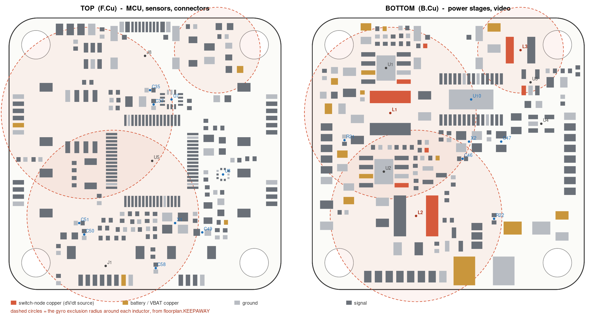

**Total time spent: 3.8 hours**

# September 17: five sheets or one, and four footprints that didn't exist

Redrew the schematic twice, then made the board routable.

I had built it hierarchically first - five pages, power / MCU / sensors / video /
IO, with a block diagram on the root sheet. Textbook, and I hated using it. The
problem is that a flight controller has almost no internal structure. The MCU
touches everything. Every sheet ended up with eight hierarchical pins on it and
half my time went on flipping pages to answer "where does this actually go".

So I redrew it as **one A1 sheet with nineteen named sections** - boxed regions
with titles, laid out roughly where the parts sit on the board. Power bottom
left, sensors top right, video along the bottom, connectors round the edge in the
order they physically appear. Big sheet, but you can follow a net across the whole
design without changing page.

Also fixed something that had been wrong since the first layout: **three of the
side connectors were mirrored.** The nets were right, but the JST housing opened
toward the middle of the board, so the wires would come out, turn 180 degrees and
run back over the components. On a board this size there is nowhere for that loop
to go. I only caught it by exporting the placement as a picture and looking at it
instead of reading the netlist.

And the power stage was twice as tall as it needed to be - two separate blocks
stacked vertically, each with its own input caps strung out beside it. Redrawn as
two loops sharing one input bank, which halved the height of that region and
freed the space the 10 V rail needed to reach the VTX connector.

Then the netlist import failed on four parts. "Footprint not found", which is
accurate and useless. All four were footprints I had named in the schematic but
never drawn into the project library - both bucks' SO-8EP, the crystals' 3225,
and the USB-C. I had been referencing KiCad's stock libraries by name in some
places and my own in others. Drew all four properly from the manufacturers'
drawings. New rule: if it is on the board, its footprint lives in this repo.

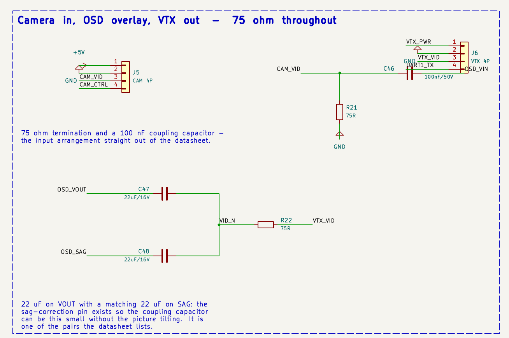

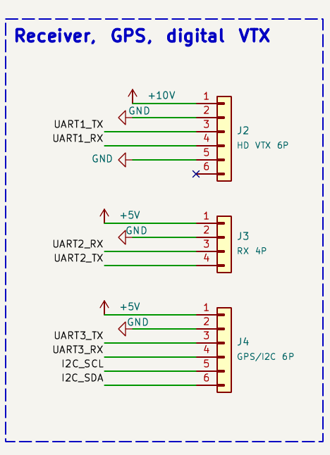

**Total time spent: 3.4 hours**

# September 18: routing it by hand

Routing. This board has maybe fifteen nets where the geometry _is_ the design -
the two switching loops, the gyro's SPI, the video path - so I routed those
sections by hand and paid attention to every return path. The rest of the board
was slower, but at least I knew why every track was where it was.

The stackup, decided before the first track: **F.Cu signal / In1.Cu solid ground /
In2.Cu signal plus ground pour / B.Cu signal.** The rule I gave myself is that
nothing crosses In1. Ever. Every fast edge on the board has an uninterrupted
return path directly under it, and the moment you slot that plane to squeeze a
track through, the return current goes the long way round and you have built a
loop antenna instead of a trace.

Order of work, because it matters:

1. The two power loops first, while there was still empty copper to do them
   properly. Input cap to FET to inductor to output cap, and the return stitched
   straight down to In1 underneath rather than run around.
2. Then the gyro. SPI1 kept short and away from both inductors - the floorplan
   has a keepaway circle drawn round each one for exactly this.
3. Then the video path. Camera in, through the OSD, out to the VTX connector -
   75 ohm-ish throughout and as direct as the board allows, because every
   millimetre and every via in that path is latency and reflection I don't get
   back.
4. Everything else last, into whatever is left.

The MCU escape ring is the hard part. LQFP-64 at 0.5 mm pitch means 64 pins
leaving a 10 mm square, and the ring of vias that gets them out eats most of the
area around the chip. Half of today was finding paths through it.

Ended at 2897 track segments and 419 vias over four layers, then laid the zones
and set the net classes properly - power nets on their own widths rather than the
default, and zone priorities so the ground pour doesn't fight the 10 V rail.

One thing I noticed while tidying: I have no revision marking on the silkscreen
at all. Not a problem now. A very big problem when there are three prototype
batches on the desk and no way to tell them apart. Added it to the list.

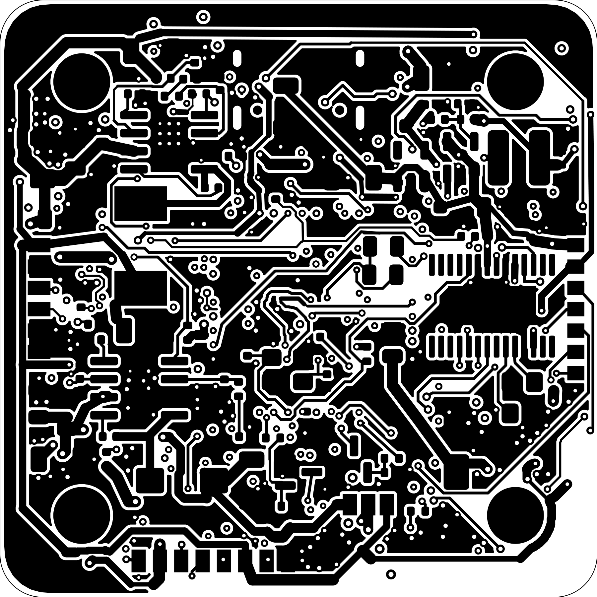

**Total time spent: 2.2 hours**

# September 19: reading it back cold

Deliberately left it alone for a day and came back to it cold, because I cannot
review something I drew an hour ago - I read what I meant instead of what is
there.

Then I wrote a status document describing the board as if I were handing it to
somebody else. That trick works on me. I can skim my own work, but I cannot write
a description of it without noticing what I am glossing over.

Three things I only saw because I had to write them down:

- **I could not state the input current limit.** I knew the copper was fine; I had
  checked every trace width against IPC-2221. I had never once asked what the
  _connector_ could pass. That turns out to be the number that constrains the
  entire design, and I get to it on the 21st.
- **The board is 38 x 38 and I don't know if that is final.** It is not. Once the
  full connector ring was laid out with proper approach clearances it went to
  42 x 42.
- **No revision marking**, as noted yesterday.

Writing "this board can deliver X" and being unable to fill in X is the cheapest
way I know to find a hole in my own understanding.

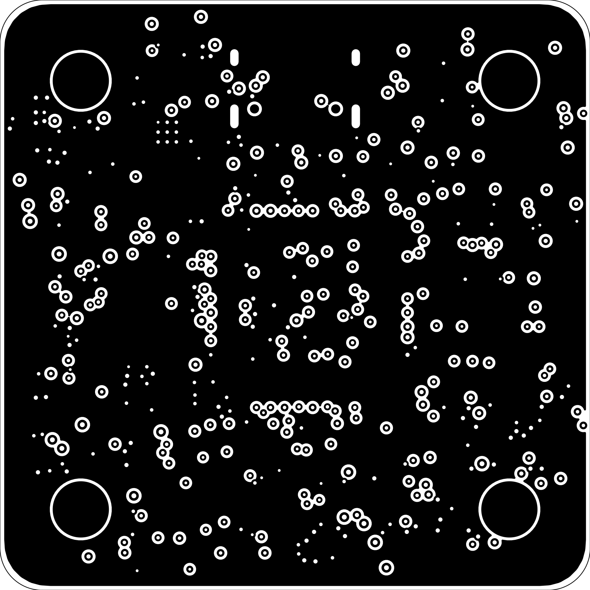

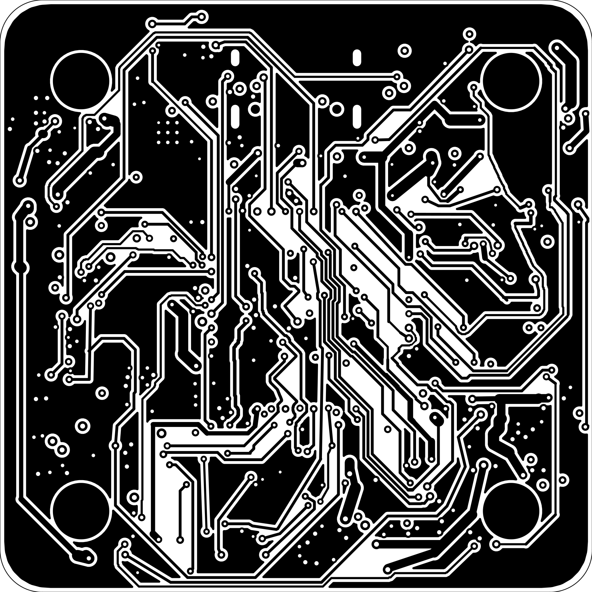

**Total time spent: 2.1 hours**

# September 20: 5.5 out of 10

Full inspection today, scored honestly, and it came out **5.5 out of 10**. Not a
fun morning.

I rendered the silkscreen for both sides and went through the whole board against
JLCPCB's published capabilities rather than KiCad's defaults, which is where most
of this came from.

**Vias inside reflowed pads. Eighteen of them.** A via in a pad that gets solder
paste wicks the solder down the barrel, and you get a joint that looks perfect
and isn't. Worst offender was a 0.55 mm via sitting in the gyro's 0.68 x 0.25 mm
pad.

**Annular rings under the fab's minimum. 276 vias at 0.100 mm** against JLCPCB's
0.130 mm. Every one of those is a potential open circuit, and my DRC was silent
about all of them, because I had set my own rules looser than the fab's. That is
the lesson of the day, really: **DRC only tells you what you told it to care
about.**

**Rails too narrow.** The 10 V feed to the VTX connector is 0.250 mm, which is
about 1.19 A by IPC-2221 at a 20 degree rise, feeding a rail I sized for 2 A. The
5 V trunk is 0.200 mm.

**Silkscreen over pads**, in seven places, which gets clipped away in
manufacturing.

Scoring it as a number is the useful part, because it stops you negotiating with
yourself. A board with 276 undersized vias is not "nearly there with a few items
outstanding". It is 5.5, and 5.5 does not ship.

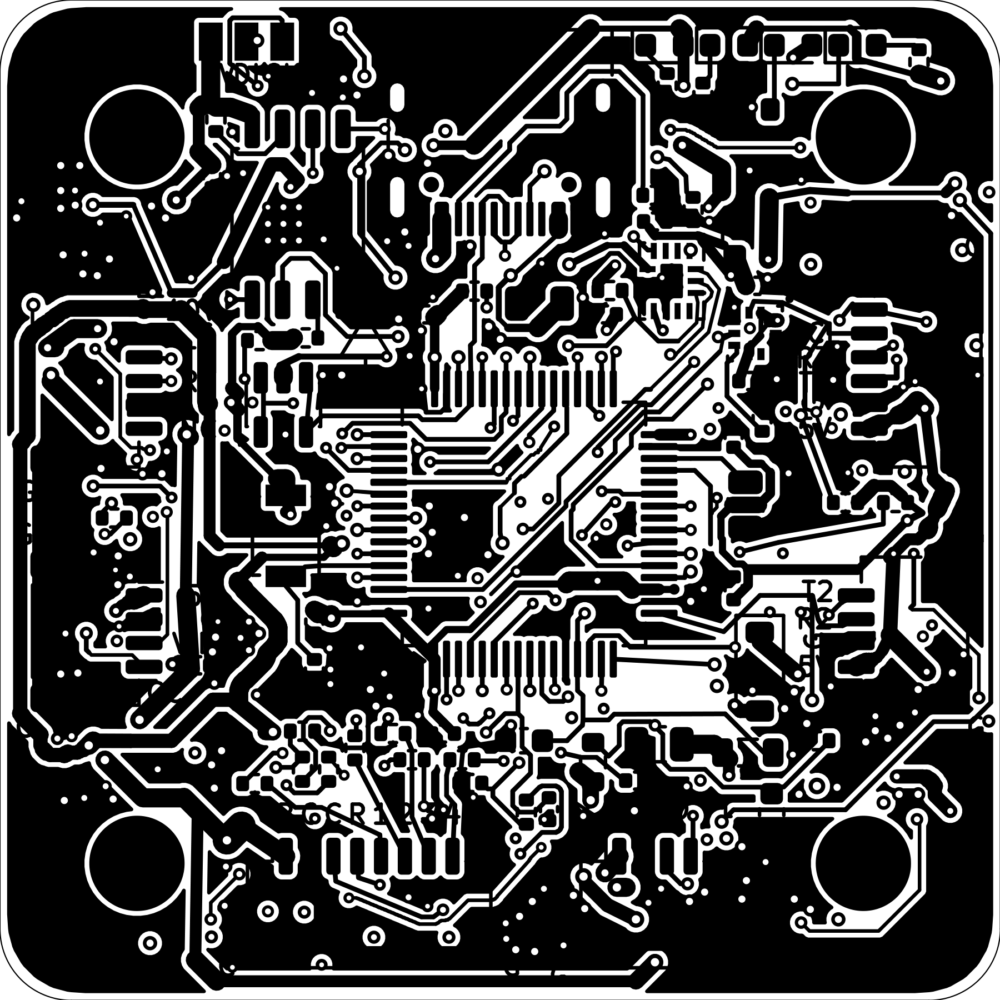

**Total time spent: 3.4 hours**

# September 21: R2, R3, R4 - rules, rails, and twelve dots that weren't there

Three revisions in a day. Sorted yesterday's list into things with exactly one
correct answer, things that need a decision, and things I am going to have to
live with - because fixing a cosmetic problem badly is how you break a working
board.

**R2 was the mechanical half.** Design rules first, because most of the
violations were invisible until the rules were right: annular ring 0.125 mm,
through-hole 0.20 mm, track 0.10 mm, copper-to-edge 0.20 mm. Then grow all 276
undersized vias until their rings meet spec. A via at 0.45 mm diameter on a
0.20 mm drill gives exactly 0.125 mm of ring, and 0.20 mm drills carry no
surcharge as long as the pad is 0.45 mm or bigger, so that fix cost nothing but
the time.

**R3 was the fab rules and the rails.** 10 V went from 0.250 to **0.600 mm**
(2.21 A), 5 V from 0.200 to **0.400 mm** (1.66 A). Neither fits as a single trace
on this board, so both are parallel bridges - two tracks on different layers
stitched together with vias. Seven of the eighteen in-pad vias moved out. DRC hit
**0 violations** for the first time.

Also read JLCPCB's process rules properly rather than from memory, and found I
had been designing to their _non-plated_ slot minimum of 1.0 mm when the plated
minimum is 0.35 mm, and that parts on both sides puts the job in Standard PCBA
rather than Economic, which has a 70 x 70 mm minimum panel. My board is 42 x 42,
so it gets ordered as a 2 x 2 panel whether I like it or not. Better to know that
now than at checkout.

**Then I critiqued R3**, looking specifically for things that pass DRC and are
still wrong, and found the one that matters most:
**the input connector.** VBAT enters on one JST-SH contact rated 1 A and returns
on another. I had been checking copper widths this whole project and the copper
was never the limit. 1 A means 11 W on 3S, 15 W on 4S, 22 W on 6S. An HD VTX
drawing 12 W is fine on 6S, marginal on 4S and over the limit on 3S. Not a DRC
violation. Would have been a surprise in the air.

**R4: four motors, not six.** It is a quad. Six outputs tied up two timers and
two DMA streams for pads nobody will solder. And cutting back revealed that motor
4 was on **PB1**, to which there is _no route on this board_ - not a hard route,
none; every path at every width blocked by the escape ring. I found that by
trying to route it and failing. Moved to PC8, which routes in 14.9 mm with zero
vias.

Then the thing that nearly ended the project. ERC had been showing 16 errors that
I had written off as noise. They were not noise. **Twelve wires
ended on the interior of another wire with no junction dot**, and KiCad does not
treat that as a connection. What was disconnected: the feedback tap on the 5 V
rail, on the 10 V rail, on the 3V3 rail, and **both terminals of the 8 MHz
crystal.** Three regulators running open loop and an MCU with no clock. I had
dismissed the one check that was telling me the truth, because I had decided in
advance what its errors meant.

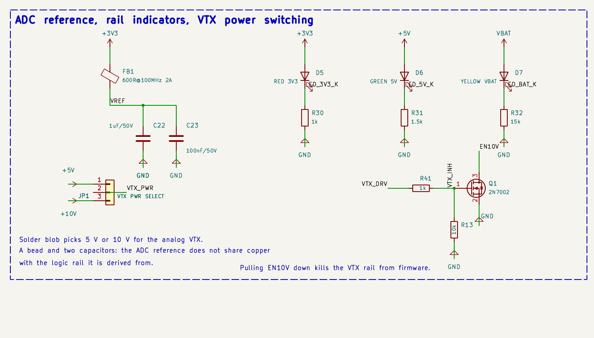

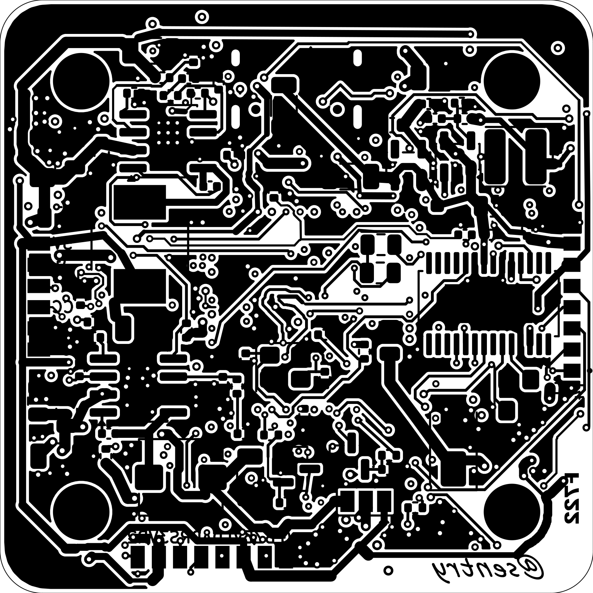

**Total time spent: 3.7 hours**

# September 22: R5, R6, and the production files

Last two revisions, then the files that actually go to the fab.

**R5: the silkscreen was lying.** Seven of ten connectors mislabelled. J10 pad 2
said M5 and it is ground. Pad 3 said M6 and it is camera control - both left over
from when this was a six-motor board. J11's buzzer pad had no label at all and
BZ- sat over the ground pad next to it. J1's legend was drawn at 1.5 mm pitch
over 1.0 mm pads, so CUR sat over the telemetry pin. Somebody soldering an LED
strip to the pad marked M5 would have shorted it to ground, and **none of that
shows up in DRC or ERC** - the copper is correct, the writing on top of it is
not. All 41 stale labels deleted, 42 new ones placed, one per pad.

Also bumped the ADC series resistors from 1k to 2.2k. PC0-PC3 are not 5 V
tolerant, and at 1k a 12 V miswire injects 8 mA into the clamp against a 5 mA
limit.

**R6: zero means zero.** Chased the last four ERC warnings instead of calling
them benign, which after the junction dots I no longer trust myself to do. One
was the gyro's FSYNC pin typed wrong in my own symbol. Three were labels sitting
on top of wire crossings. **ERC: 0 errors, 0 warnings.** Got five more vias out
of reflowed pads, twelve down to seven; the remaining seven are boxed in by their
own escape routing and moving them means rerouting nets that currently work.
DRC is 0 errors and one silkscreen warning I am deliberately leaving - a legend
character clipping the OSD's outline, cosmetic, and chasing it broke the
footprint link last time I tried.

**Then the production files.** BOM and CPL generated from the board itself rather
than the schematic, so what gets ordered is what is actually placed:

- **69 distinct lines, 137 placements** - 66 on top, 71 on the bottom
- Every line carries an **LCSC part number**, so the whole board assembles from
  JLCPCB stock with nothing for me to supply
- Parts on both sides, so it is **Standard PCBA**, 70 x 70 mm minimum panel,
  42 x 42 board, ordered as a 2 x 2
- Netlist cross-checked both directions: **483 pins, 105 nets, schematic and
  board agree**

Wrote the README and the pinout document last. The pinout one matters more than
it sounds: the silkscreen only has room for one or two characters beside a 1 mm
pad pitch, so `B G C R 1 2 3 4` on the ESC header needs a legend somewhere, and
the firmware notes - the DShot burst-mode flag, the timer and DMA table, which
UART is which - belong next to it rather than in my head.

Six revisions to get one board right. Looking at the finished copper, the routes
zig-zag everywhere: 45-degree dog-legs weaving round the escape ring, doubling
back to find a gap. Looks exactly like the roads back home. Nothing goes
straight, everything gets there.

R1 was 5.5 out of 10 and I thought it was nearly done. R6 has 0 DRC errors, 0 ERC
errors, 483 pads matching the schematic pin for pin, and every conductor inside
its rating. The distance between those two boards is this entire journal.

## Production renders

The final production views show both assembly states and both sides of the
board. The no-component views are useful for checking the bare PCB and the
component views make the placement and connector orientation easy to inspect.

**Total time spent: 3.4 hours**
