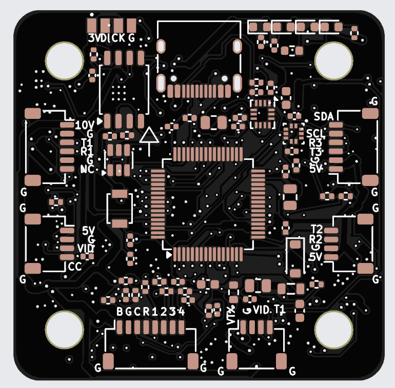
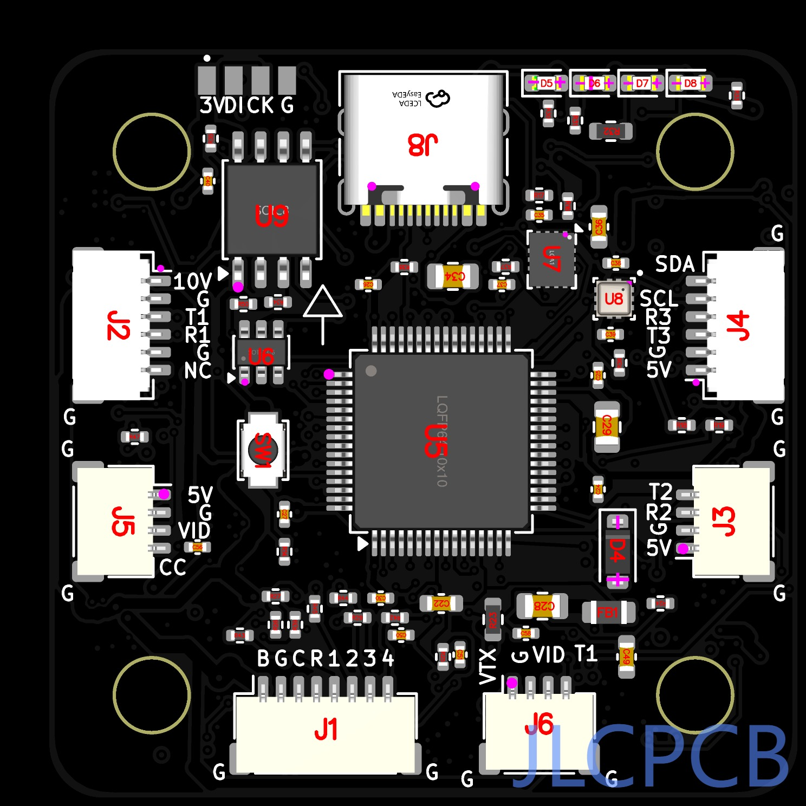
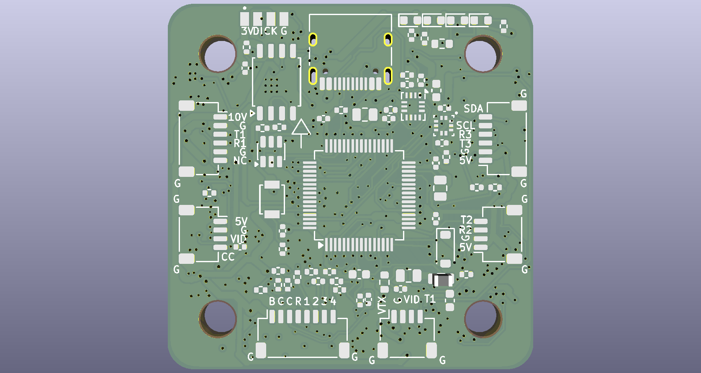
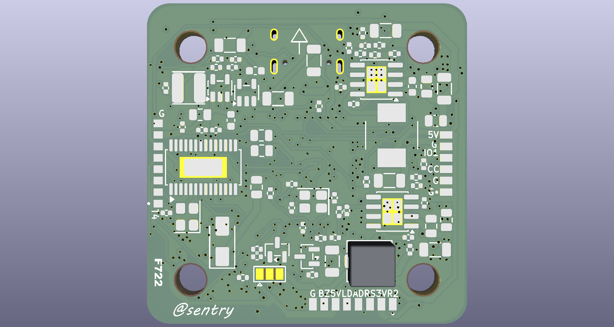
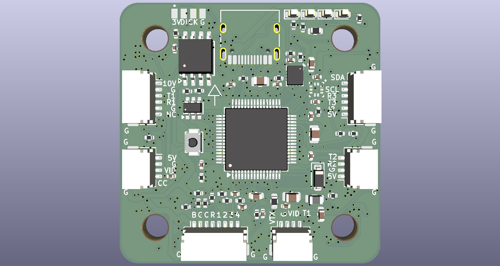
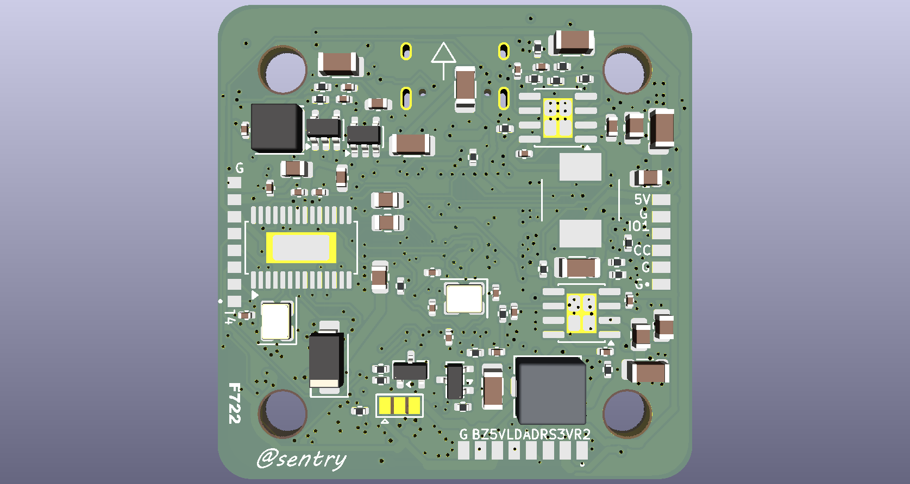

<h1 align="center">
   
  Vayu F7
   
</h1>

<h4 align="center">
A production-grade STM32F722 FPV flight controller built in KiCad, designed for
5-inch and 7-inch builds and documented the same way as a serious hardware
project should be.
</h4>

  <a href="#what-it-is">What it is</a> •
  <a href="#specifications">Specifications</a> •
  <a href="#hardware-overview">Hardware overview</a> •
  <a href="#pinout">Pinout</a> •
  <a href="#flight-controller-firmware">Firmware</a> •
  <a href="#building-one">Building one</a> •
  <a href="#license">License</a>

---

## What it is

*Vayu* (वायु) is the Sanskrit word for wind.

This is a 42 × 42 mm, four-layer FPV flight controller built around the
STM32F722 for 5-inch and 7-inch quads doing cinematic, telemetry, and general
performance work. It is designed to sit in the same class as well-known F722
boards while adding a cleaner power layout, a proper barometer, and a 10 V rail
sized for an HD VTX or analogue system.

The board is fully designed in KiCad.

## Specifications

| | |
|---|---|
| **MCU** | STM32F722RET6, Cortex-M7 @ 216 MHz, 512 KB flash, 256 KB RAM |
| **Gyro / accel** | ICM-42688-P on SPI1 |
| **Barometer** | BMP388 on I²C1 |
| **Blackbox** | W25Q128JVSIQ — 16 MB SPI NOR on its own bus |
| **OSD** | AT7456E analogue OSD, fitted |
| **Input** | 3S–6S (11.1–25.2 V), TVS clamp on the battery rail |
| **5 V BEC** | AP64350 synchronous buck, 5.00 V, 2 A |
| **10 V BEC** | AP64350 synchronous buck, 10.06 V, switchable for VTX rail |
| **3.3 V** | TLV62569 buck + LP5907-3.3 LDO for analogue rail |
| **Motor outputs** | 4 outputs with timer-backed DShot-capable design |
| **UARTs** | 6 total, with pads and connector-backed serial ports |
| **I²C** | 1, on the GPS connector |
| **Board** | 42 × 42 mm, 30.5 × 30.5 mm M3 mounting, 4 layers, 1.6 mm |
| **Stack-up** | F.Cu signal / **In1.Cu solid ground plane** / In2.Cu signal + ground pour / B.Cu signal |
| **Connectors** | ESC, GPS-I²C, RX, camera, VTX, USB-C |

### Power budget

| Rail | Source | Typical role |
|---|---|---|
| +10V | AP64350 buck | HD VTX / high-power video rail |
| +5V | AP64350 buck | main logic and peripheral rail |
| +3V3 | TLV62569 + LP5907 | MCU, IMU, barometer, logic |
| VBAT | input connector | raw battery feed for the switching rails |
| USB_VBUS | USB-C | debug / boot / low-power use |

## Pinout

The connector map is documented in the repo and kept together with the hardware
notes. The board includes the usual FPV stack connectors for:

| Connector | Purpose | Notes |
|---|---|---|
| ESC | Motor outputs and battery feed | 8-pin JST-SH style connector |
| GPS / I²C | GPS and barometer / compass bus | I²C and UART combination |
| HD VTX | Video and telemetry port | For HD VTX systems |
| RX | Serial receiver connection | Standard FPV receiver port |
| Camera | Camera connection | Analog / camera feed path |
| USB-C | DFU / flashing / debug | Board programming and serial access |

## Flight controller firmware

Because this project is a custom hardware layout, firmware is normally built from
upstream Betaflight or iNav sources rather than from a pre-generated target in a
factory build. The repository includes the custom target scaffold for both
firmware ecosystems so the board can be adapted to the normal upstream build
process.

### Betaflight

This repository now includes the custom Betaflight target definition at
[firmware/source/betaflight/config.h](firmware/source/betaflight/config.h).

1. Clone the upstream Betaflight repository.
2. Install the required GCC / toolchain dependencies.
3. Run `make configs` in the Betaflight tree.
4. Create a custom target directory, for example `src/config/configs/VAYUF7/`.
5. Copy [firmware/source/betaflight/config.h](firmware/source/betaflight/config.h)
   into that target directory.
6. Build the target with `make VAYUF7`.
7. Flash the resulting `.hex` via USB DFU or SWD.

The board mapping used in the target is aligned to the actual hardware:
- STM32F722RET6
- ICM-42688-P on SPI1
- BMP388 on I2C1
- AT7456E on SPI2
- W25Q128 on SPI3
- 4 motor outputs on timer-backed pins

### iNav

This repository also includes the custom iNav target files in
[firmware/source/inav/CMakeLists.txt](firmware/source/inav/CMakeLists.txt),
[firmware/source/inav/target.c](firmware/source/inav/target.c), and
[firmware/source/inav/target.h](firmware/source/inav/target.h).

1. Clone the upstream iNav repository.
2. Check out a supported stable release.
3. Create a target directory, for example `src/main/target/VAYUF7/`.
4. Copy the files from [firmware/source/inav](firmware/source/inav) into that
   target folder.
5. Configure the project with `cmake ..` inside the build directory.
6. Build the target with the normal iNav build command.
7. Flash the resulting `.hex` through USB or SWD.

> The hardware design is intentionally kept independent of any vendor-specific
> firmware stack so the board can be supported by upstream projects when the
> target is created.

## Building one

Current state — revision **R6**:

| Check | Result |
|---|---|
| KiCad DRC | **0 errors**, 0 unconnected pads (1 cosmetic silk warning) |
| KiCad ERC | **0 errors, 0 warnings** |
| Schematic ↔ board netlist | match, 483 pins / 105 nets, 0 mismatches |
| Electrical stress | all pass; worst capacitor 52.8 %, worst resistor 57.6 % of rating |
| HSE gain margin | 2.4× at C0 = 3 pF |
| Minimum via annular ring | 0.125 mm, every via ≥ 0.45 mm diameter |
| Datasheet cross-check | no mismatch found in the main design references |

The project is intentionally documented as a real engineering board, not just a
rendered concept. The repository includes a project status file, revision notes,
and hardware validation data so the design can be tracked from concept through
manufacturing readiness.

The main project constraints are documented openly:

- the board is input-limited on the battery connector at the real system level
- the 10 V rail is sized for VTX use but still obeys the regulator and layout
  limits
- all critical traces, regulator loops, and crystal areas are checked as part of
  the design review rather than left implicit

## Bill of material

The design uses practical, mainstream FPV parts that are suitable for a
production-style board and are chosen with sourcing and assembly in mind. The key
parts in the current hardware are:

| Category | Item | Notes |
|---|---|---|
| MCU | STM32F722RET6 | 32-bit F7 core, 216 MHz |
| IMU | ICM-42688-P | SPI-based gyro / accel |
| Barometer | BMP388 | I²C pressure sensor |
| Flash | W25Q128JVSIQ | 16 MB SPI NOR blackbox memory |
| OSD | AT7456E | Analog video overlay device |
| Regulators | AP64350 + LP5907 / TLV62569 | 5 V, 10 V, 3.3 V generation |
| Connectors | JST-SH / USB-C | Standard FPV and service interfaces |
| Board | 4-layer PCB | 42 × 42 mm, 30.5 × 30.5 mm mounting |

The repository is organized around the actual board design, not around a generic
marketing sheet. The hardware files, status records, and revision notes are the
source of truth for assembly and manufacturing decisions.

## BOM

The table below is the assembly BOM generated from the production files. Prices
are indicative USD unit prices from the currently displayed LCSC quantity tier
for the listed minimum order, checked on 2026-09-22. They exclude PCB
fabrication, assembly, shipping, tax, and tooling. `quote` means the public
product page did not expose a current price and should be checked in the JLCPCB
order quote.

| SL NO | LCSC NO | COMPONENT | PRICE IN USD |
|---:|---|---|---:|
| 1 | C29823 | C1, C2 - 4.7uF/50V, qty 2 | 0.0853 |
| 2 | C12891 | C10, C14, C15, C17, C8, C9 - 22uF/25V, qty 6 | 0.0904 |
| 3 | C1525 | C11, C5 - 100nF/16V, qty 2 | 0.0023 |
| 4 | C1531 | C12, C60 - 2.2nF, qty 2 | 0.0014 |
| 5 | C106203 | C13 - 22pF, qty 1 | 0.0023 |
| 6 | C3039694 | C16, C34 - 10uF/16V, qty 2 | 0.0699 |
| 7 | C307331 | C18, C21, C23, C24, C25, C26, C27, C30, C33, C35, C37, C38, C39, C40, C41, C42, C43, C46, C50, C51, C56, C58 - 100nF/50V, qty 22 | 0.0046 |
| 8 | C5199872 | C19, C20, C22, C49 - 1uF/50V, qty 4 | 0.0107 |
| 9 | C2885646 | C28, C29 - 4.7uF/16V, qty 2 | 0.0236 |
| 10 | C437557 | C3, C52, C53, C54, C55 - 4.7uF/50V, qty 5 | 0.1152 |
| 11 | C107004 | C31, C32 - 15pF, qty 2 | 0.0013 |
| 12 | C415535 | C36 - 2.2uF/16V, qty 1 | 0.0412 |
| 13 | C14663 | C4 - 100nF/50V, qty 1 | 0.0052 |
| 14 | C45783 | C47, C48 - 22uF/16V, qty 2 | 0.1037 |
| 15 | C189470 | C59 - 6.8pF, qty 1 | 0.0016 |
| 16 | C107024 | C6 - 1.8nF, qty 1 | 0.0021 |
| 17 | C107002 | C7 - 27pF, qty 1 | 0.0015 |
| 18 | C908777 | D1 - SMAJ33A, qty 1 | 0.0167 |
| 19 | C64885 | D4 - B5819W, qty 1 | 0.0091 |
| 20 | C2286 | D5 - RED 3V3, qty 1 | 0.0035 |
| 21 | C965804 | D6 - GREEN 5V, qty 1 | 0.0031 |
| 22 | C965802 | D7 - YELLOW VBAT, qty 1 | 0.0038 |
| 23 | C965807 | D8 - BLUE STATUS, qty 1 | 0.0027 |
| 24 | C1017 | FB1 - 600R@100MHz 2A, qty 1 | quote |
| 25 | C160407 | J1 - ESC 8P, qty 1 | 0.1840 |
| 26 | C53055322 | J2 - HD VTX 6P, qty 1 | 0.0349 |
| 27 | C160404 | J3 - RX 4P, qty 1 | 0.1245 |
| 28 | C53055322 | J4 - GPS/I2C 6P, qty 1 | 0.0349 |
| 29 | C160404 | J5 - CAM 4P, qty 1 | 0.1245 |
| 30 | C160404 | J6 - VTX 4P, qty 1 | 0.1245 |
| 31 | C165948 | J8 - USB-C 16P, qty 1 | 0.0971 |
| 32 | C167221 | L1 - 6.8uH FXL0630-6R8-M, qty 1 | 0.0827 |
| 33 | C189932 | L2 - 10uH SRP5030T-100M, qty 1 | 0.6640 |
| 34 | C50543 | L3 - 2.2uH SWPA4018S2R2MT, qty 1 | quote |
| 35 | C8545 | Q1 - 2N7002, qty 1 | 0.0106 |
| 36 | C20917 | Q2 - AO3400A, qty 1 | 0.0482 |
| 37 | C159047 | R1, R7 - 294k, qty 2 | 0.0004 |
| 38 | C25748 | R10 - 118k, qty 1 | 0.0013 |
| 39 | C5153958 | R11, R5 - 10.2k, qty 2 | 0.0010 |
| 40 | C2998091 | R12 - 31.6k, qty 1 | 0.0014 |
| 41 | C25744 | R13, R14, R20, R28, R34, R35, R36, R37, R38, R50 - 10k, qty 10 | 0.0017 |
| 42 | C25905 | R16, R17 - 5.1k, qty 2 | 0.0012 |
| 43 | C25879 | R18, R19, R25, R26, R39 - 2.2k, qty 5 | 0.0026 |
| 44 | C2960799 | R2, R8 - 57.6k, qty 2 | 0.0012 |
| 45 | C2909384 | R21, R22 - 75R, qty 2 | 0.0013 |
| 46 | C25804 | R23 - 10k, qty 1 | 0.0012 |
| 47 | C11702 | R24, R30, R33, R40, R41 - 1k, qty 5 | 0.0012 |
| 48 | C25741 | R27, R49 - 100k, qty 2 | 0.0013 |
| 49 | C22369194 | R29 - 100R, qty 1 | quote |
| 50 | C2909325 | R3 - 180k, qty 1 | 0.0012 |
| 51 | C25867 | R31 - 1.5k, qty 1 | 0.0013 |
| 52 | C22809 | R32 - 15k, qty 1 | 0.0014 |
| 53 | C53398 | R4 - 53.6k, qty 1 | 0.0008 |
| 54 | C2906868 | R42, R43, R44, R45, R47 - 33R, qty 5 | 0.0012 |
| 55 | C3013172 | R48 - 453k, qty 1 | 0.0013 |
| 56 | C2998160 | R6 - 25.5k, qty 1 | 0.0013 |
| 57 | C2909311 | R9 - 110k, qty 1 | 0.0009 |
| 58 | C231329 | SW1 - BOOT, qty 1 | 0.1025 |
| 59 | C2071691 | U1, U2 - AP64350SP-13, qty 2 | 1.1554 |
| 60 | C82351 | U10 - AT7456E, qty 1 | 1.7093 |
| 61 | C141836 | U3 - TLV62569DBVR, qty 1 | 0.0441 |
| 62 | C80670 | U4 - LP5907MFX-3.3, qty 1 | 0.1260 |
| 63 | C118207 | U5 - STM32F722RET6, qty 1 | 6.9322 |
| 64 | C2687116 | U6 - USBLC6-2SC6, qty 1 | 0.0221 |
| 65 | C1850418 | U7 - ICM-42688-P, qty 1 | 15.6022 |
| 66 | C779278 | U8 - BMP388, qty 1 | 3.6120 |
| 67 | C97521 | U9 - W25Q128JVSIQ, qty 1 | 1.6422 |
| 68 | C2682775 | X1 - 8MHz X32258MOB4SI 12pF, qty 1 | 0.0937 |
| 69 | C9008 | X2 - 27MHz X322527MSB4SI, qty 1 | 0.0489 |
| 70 | | PCB, qty 5 | 27.54 |
| 71 | | PCBA, qty 2 | 130

## Board renders

## Credits

- [KiCad](https://www.kicad.org/)
- [INAV](https://github.com/iNavFlight/inav)
- [Betaflight](https://github.com/betaflight/betaflight)
- [JLCPCB](https://jlcpcb.com/) and [LCSC](https://www.lcsc.com/)
- [Hack Club Blueprint](https://blueprint.hackclub.com/)
- The original open hardware and design process references that inspired this
  board-level documentation approach

## AI usage
This project was designed and built with the help of AI ChatGPT 5.6 precisely... AI was used to extract key important design rules for different componets pulling it off their 200pages chinglish docs ( chinese + english ). Help in creating a netlist, chosing components and drawing the schematic.
Also AI was used in writing the firmware...

> As mentioned in the resource docs, no AI was used to write slopped Journal or REAMDE.

## License

MIT
